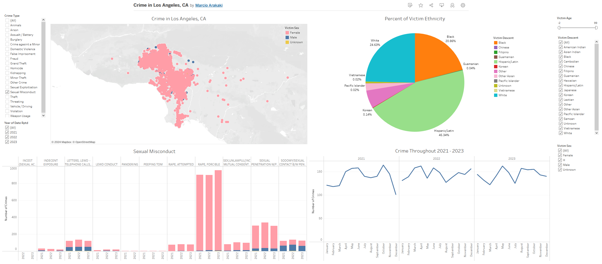

# Crime in Los Angeles Data Cleaning and Visualization

## Overview
This dataset was taken from the LAPD OpenData [crime dataset](https://data.lacity.org/Public-Safety/Crime-Data-from-2020-to-Present/2nrs-mtv8/about_data). This dataset reflects incidents of crime in the City of Los Angeles dating back to 2020. This data is transcribed from original crime reports that are typed on paper and therefore there may be some inaccuracies within the data. Some location fields with missing data are noted as (0°, 0°). Address fields are only provided to the nearest hundred block in order to maintain privacy. This data is as accurate as the data in the database.

## Data Cleaning
I used Python for my data cleaning and modification which can be viewed [here](https://www.kaggle.com/code/marcioarakaki/la-crime-cleaning-with-python). First thing I did was clean up the dates which had extra redundant information and formatted them for easier read. I prefer to use Python for data cleaning and Google Sheets for data inspection as it is easier to see faults in the data. 

## Data Visualization
For this dataset because it is so large and has many bits of information I thought it would be best to use a [Tableau Dashboard](https://public.tableau.com/app/profile/marcio22/viz/CrimeinLosAngelesCA/Dashboard1) because it would be better to have active filters to find specific data.

Data can be filtered out by:
* Victim age
* Victim sex
* Victim race
* Type of crime
* Year of crime reported

Dashboard shows where the event happened and is colored to show if the victim was female or male. The graphs shows the number of victims for each crime and the ration of men to woman for the crime. It also highlights which race is targeted the most in the pie chart.

The dataset only shows the victims of the crime and no information on the criminal, this is probably due to the victims only reporting the crimes years or months later as to not arrest anyone due to racial profiling. And probably also to not link a certain race to crime, but it would be interesting to see.
